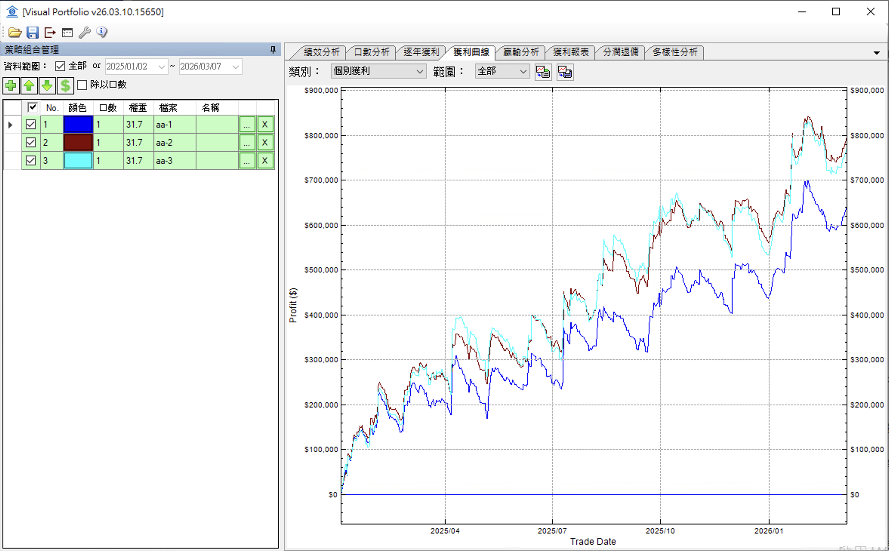

# 多樣性分析指標

1. 有7個指標：

     1. 總交易次數 (N) (主策略決定)
     2. 平均每次交易金額 (主策略決定)
     3. 有效交易次數 ($N_{eff}$) (主策略決定)
        - $N_{eff} = 1 / HHI_{time}$
          - $HHI_{time} = \sum_{i=1}^{n} \left( \frac{\text{Amount}_i}{\text{Total Amount}} \right)^2$
          - $n$：總交易次數。
          - $\text{Amount}_i$：第 $i$ 次交易的金額。
          - $\text{Total Amount} = \sum_{i=1}^{n} \text{Amount}_i$。
     4. 進場效率比 (Entry Efficiency Ratio, EER)  (主策略決定)
        - $EER = \frac{N_{eff}}{N}$
          - $N_{eff}$：有效分散筆數。
          - $N$：總交易次數。
        - EER = 100%：完美的均勻進場。
        - EER = 70% ~ 80%：代表你有大有小，但整體還算分散。
        - EER < 60%：警訊。代表你雖然分批進場，但大筆金額太過突出，分散流於形式。
     5. 風險分散率 (Risk Diversification Ratio, RDR) (主策略-子策略)
        - 公式： $RDR = \frac{\sum w_{i} \sigma_{i}}{\sigma_{p}}$ （個別風險總和 / 合併後的風險）
          - $\sigma_{i}$ = 策略 i 的標準差（波動度）。
          - $\sigma_{p}$ = 組合策略的標準差（波動度）。
          - $w_{i}$ = 策略 i 的權重。   
        - 含義：這代表您的組合透過互相抵銷，讓整體的風險（波動）比各別策略加權總和小了 $23.85\%$。
        - $RDR = 1.0$：完全沒分散（像買三份一樣的東西）。
        - $RDR > 1.0$：有分散效果。數值越高，代表分散得越成功。數值越高（例如 $>1.5$）代表分散效果越驚人。
        - $RDR$ 的大小取決於兩個因素：策略數量 ($N$) 與 策略間的相關性 ($\rho$)。如果策略之間「完全不相關」 ($\rho = 0$)：在這種理想情況下（假設每個策略權重與波動度一致），公式會簡化為 $RDR = \sqrt{N}$
          - 如果你有 2 個 不相關策略： $RDR = \sqrt{2} \approx \mathbf{1.41}$
          - 如果你有 3 個 不相關策略： $RDR = \sqrt{3} \approx \mathbf{1.73}$
          - 如果你有 4 個 不相關策略： $RDR = \sqrt{4} = \mathbf{2.00}$
          - 如果你有 10 個 不相關策略： $RDR = \sqrt{10} \approx \mathbf{3.16}$
          - 結論：要達到 $DR=2$，你至少需要 4 個完全不相關的策略，且權重分配完美。
     6. 分散相關指數 (Diversity Correlation Index, DCI) (主策略-子策略)
        - DCI 公式： $DCI = \frac{\sum_{i} \sum_{j \neq i} w_{i} \cdot w_{j} \cdot \rho_{ij}}{\sum_{i} \sum_{j \neq i} w_{i} \cdot w_{j}}$
          - $\rho_{ij}$ = 策略 i 和 策略 j 的相關係數。
          - $w_{i}$ = 策略 i 的權重。
        - DCI = 1：所有策略都同步(完全相關)（例如都是做多台指）。
        - DCI = 0：策略間完全不相關（理想狀態）。
        - DCI < 0：策略間呈現負相關（完美對沖，非常罕見）。 
     7. 有效策略數 (Effective Number of Bets, ENB) (主策略-子策略)
        - ENB 公式： $N_{ENB} = \frac{(\sum w_{i})^2}{\sum_{i} \sum_{j} w_{i} w_{j} \rho_{ij}}$
          - $\rho_{ij}$ = 策略 i 和 策略 j 的相關係數。
          - $w_{i}$ = 策略 i 的權重。
        - 如果你有 10 個「完全獨立」的策略（相關係數為 0）： $N_{ENB} = \frac{1}{10 \times (0.1)^2} = \mathbf{10}$。這代表你的組合效果等同於買了 10 份完全不相關的資產。
        - 如果你有 10 個「高度相關」的策略（例如都是做多台指）： $N_{ENB}$ 會遠小於 10，可能只有 2 或 3。這代表你的「分散」只是形式上的，實際上風險非常集中。
     8. 交易金額重疊率 (Volume Overlap Ratio, VOR) (主策略-子策略)
      - **公式 (正規化)**： $VOR = \frac{\text{原始重疊率}}{\text{最大可能重疊率}}$
        - **原始重疊率** = $\frac{\sum_{t} \left( \sum_{i} x_{it} - \max_{i} x_{it} \right)}{\sum_{t} \sum_{i} x_{it}}$ （其中 $x_{it}$ 為各策略加權金額）
        - **最大可能重疊率** = $\frac{\sum W_{eff, i} - \max(W_{eff, i})}{\sum W_{eff, i}}$ （基於有效資金佔比 $W_{eff}$）
      - **含義**：不同策略在同一時間一起進場的程度。
        - 0%：完全不重疊（兵分多路，進場分散極佳）。
        - 100%：完全重疊（策略高度同步，進場集中）。

2. 表格
     | 指標                     | 範圍       | 說明               |
     | ------------------------ | ---------- | ------------------ |
     | 1. 總交易次數 (N)           | 任意整數   |                    |
     | 2. 平均每次交易金額         | 任意正實數 |                    |
     | 3. 有效交易次數 ($N_{eff}$) | 1 ~ N      | 愈大愈分散         |
     | 4. 進場效率比 (EER)         | 0%~100%    | 愈大愈分散         |
     | 5. 風險分散率 (RDR)         | >= 1.0     | 愈大愈分散         |
     | 6. 分散相關指數 (DCI)       | -100%~100% | 愈小愈好，0 無相關 |
     | 7. 有效策略數 (ENB)         | 1 ~ 策略數 | 愈大愈好。         |
     | 8. 交易金額重疊率 (VOR)     | 0% ~ 100%  | 愈小愈分散         |

3. 舉例:
   aa-1, aa-2, aa-3 是 BDS 用不同停損的策略
   績效曲線

   

   可以看出，它們的相似性很高，並沒有很好的分散，但aa-2, aa-3 比較像，aa-1 相對比較不像。

   在多樣性分析，我們可以先只看一個策略，如aa-1，7個指標，前4個(總交易次數、平均每次交易金額、有效交易次數、進場效率比)是單一策略指標，單獨策略就可以看，後面3個(風險分散率、分散相關指數、有效策略數)則是相關指標，需要多個策略計算才有意義，也是比較重要的。

   **總交易次數**： 就是同一時間(同一分)的交易都只算一次，總共幾次。
   
   **有效交易次數**： 若是100次交易(=總交易次數)，每次交易都是101元，全部交易金額10100元，有交易次數就是100次，我們另一個極端的例子，100次交易(=總交易次數)，有一次交易10001元，其他99次都交易1元，全部交易金額也是 10100元。 雖然它的總交易次數是100，但有效交易次數約等於 1。
   
   **進場效率比**：  有效交易次數 / 總交易次數，若是愈接近 1，表示進場金額愈平均，通常是愈好，但這只是相對參考，在考慮 BDS 只下一口且固定金額1萬，則每次交易金額都會一樣(1萬)，則「進場效率比」會等於100%，但是將兩個這種策略(參數不同)合併時，則有些時間可能會重疊，所以有些金額比較大(2萬)，有些比較小(1萬)，這樣算出來的「進場效率比」就會小於100% (如80%)，但合併後的分散效率一定比原來好。所以「進場效率比」只是當作自已交易金額分佈的參考，不同策略比較沒有太大的意義。
   
   
   
   後面三個(風險分散率、分散相關指數、有效策略數)則是相關指標，需要多個策略計算才有意義，也是比較重要的。
   其計算公式參考上面，這邊說明它怎麼看。
   RDR=1.05，DCI=86.73%，ENB=1.10
   
   RDR 若是一個策略或是完全相同策略，就是1。 這個 1.05 就是非常的分散。
   
   DCI 若是一個策略或是完全相同策略，就是100%。86.73% 表示這些策略還是很像。
   
   ENB 就是等同幾個策略，雖然是三個策略合在一起，但執行起來並不像三個獨立，若是三個完全獨立的策略，它算起來會是3，這裡算出1.1，就是這三個策略約等於1.1 個策略的分散。
   
   

